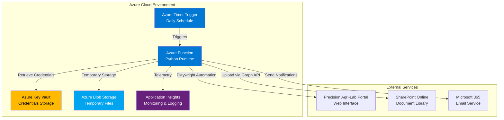
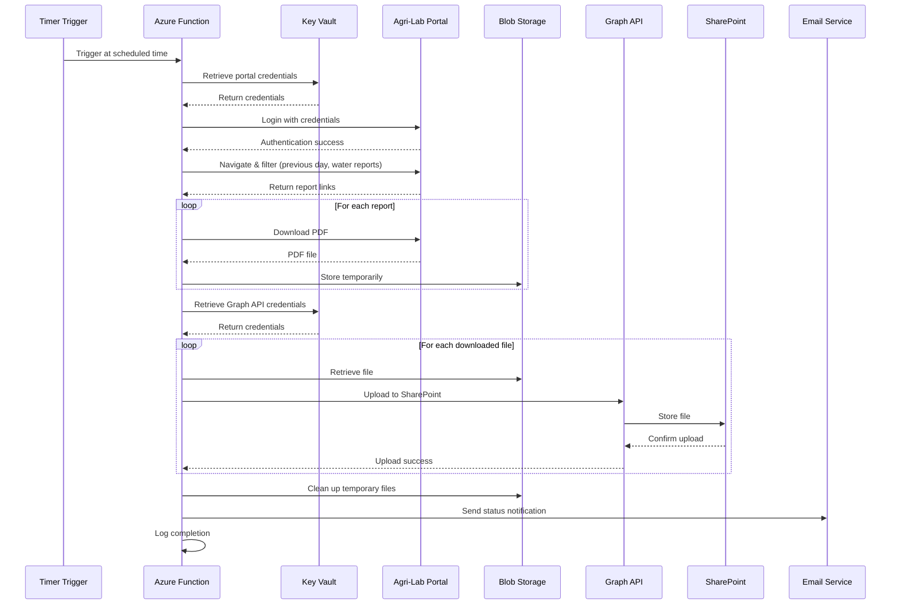
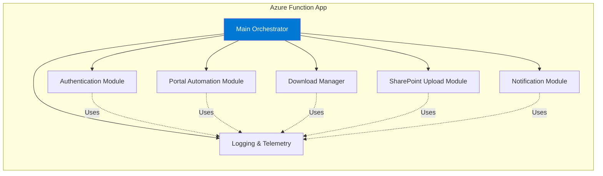
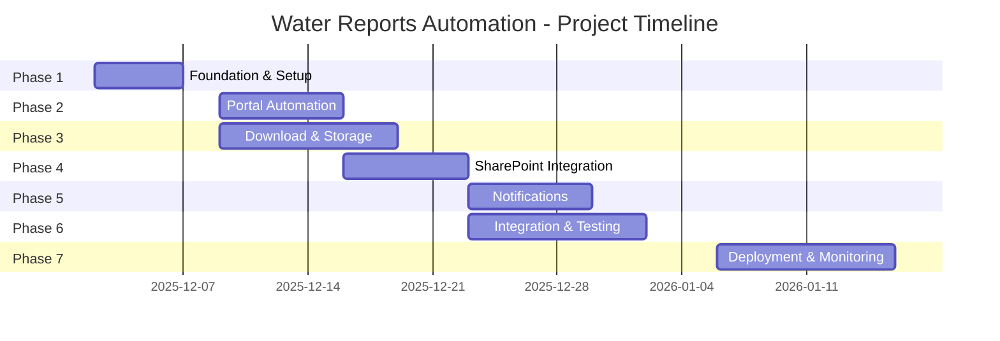

# Precision Agri-Lab Water Reports Automation - Detailed Planning Document

**Project Name:** Automated Water Reports Processing System  
**Client:** Meras  
**Document Version:** 1.0  
**Date:** November 27, 2025  
**Prepared By:** Development Team

---

## Executive Summary

This document outlines the comprehensive plan for developing and deploying an automated solution to streamline the daily processing of water reports from the Precision Agri-Lab portal. The system will automatically download water reports, upload them to SharePoint, and provide email notifications about the process status.

### Key Objectives
- Eliminate manual daily report processing
- Ensure timely and reliable report archival
- Provide visibility into process execution through notifications
- Maintain data integrity and security

---

## Table of Contents

1. [Project Overview](#project-overview)
2. [Functional Requirements](#functional-requirements)
3. [Technical Architecture](#technical-architecture)
4. [Detailed Component Design](#detailed-component-design)
5. [Security & Compliance](#security--compliance)
6. [Implementation Plan](#implementation-plan)
7. [Testing Strategy](#testing-strategy)
8. [Deployment Plan](#deployment-plan)
9. [Monitoring & Maintenance](#monitoring--maintenance)
10. [Risk Assessment](#risk-assessment)
11. [Timeline & Milestones](#timeline--milestones)
12. [Budget Considerations](#budget-considerations)
13. [Appendices](#appendices)

---

## 1. Project Overview

### 1.1 Business Context
Meras requires daily access to water quality reports from the Precision Agri-Lab portal. Currently, this is a manual process that is time-consuming and prone to human error. Automation will improve efficiency, reliability, and ensure no reports are missed.

### 1.2 Solution Summary
An Azure Function-based automation system that:
- Runs on a daily schedule
- Accesses the Precision Agri-Lab portal programmatically
- Downloads water reports from the previous day
- Uploads reports to SharePoint
- Sends status notifications via email

### 1.3 Success Criteria
- ✅ 100% automated execution without manual intervention
- ✅ All available water reports downloaded and uploaded daily
- ✅ Email notifications sent for all execution scenarios
- ✅ 99.5% uptime and reliability
- ✅ Secure credential management
- ✅ Audit trail for all operations

---

## 2. Functional Requirements

### 2.1 Portal Access & Authentication
**Requirement ID:** FR-001  
**Priority:** Critical

**Description:**
- Automated login to Precision Agri-Lab portal
- Secure credential storage in Azure Key Vault
- Session management and cookie handling
- Error handling for authentication failures

**Acceptance Criteria:**
- System successfully authenticates using stored credentials
- Failed login attempts trigger error notifications
- Session timeout handling implemented

### 2.2 Report Filtering & Discovery
**Requirement ID:** FR-002  
**Priority:** Critical

**Description:**
- Navigate to Lab Reports section
- Configure date filters (Start Date: Previous day, End Date: Previous day)
- Filter to Water reports tab only
- Extract all available PDF report links

**Acceptance Criteria:**
- Correct date range applied (previous day only)
- Only water reports identified (no other report types)
- All available reports discovered

### 2.3 Report Download
**Requirement ID:** FR-003  
**Priority:** Critical

**Description:**
- Download each identified PDF report
- Preserve original filename structure
- Append date in MM/DD/YYYY format
- Example: "MERAS_WATER_SAMPLE 11/19/2025.pdf"
- Store temporarily in secure location

**Acceptance Criteria:**
- All reports downloaded successfully
- Filenames follow specified format
- File integrity verified (valid PDF format)
- Temporary storage cleaned after upload

### 2.4 SharePoint Upload
**Requirement ID:** FR-004  
**Priority:** Critical

**Description:**
- Upload all downloaded PDFs to designated SharePoint folder
- Use Microsoft Graph API for authentication and upload
- Maintain original file metadata
- Handle duplicate files appropriately

**Acceptance Criteria:**
- All files uploaded to correct SharePoint location
- Upload failures logged and reported
- Duplicate handling strategy implemented
- Upload verification performed

### 2.5 Email Notifications
**Requirement ID:** FR-005  
**Priority:** High

**Description:**
Send email notifications from it@meras.com to it@meras.com for the following scenarios:

**Success (all files uploaded):**
- Subject: "✅ Water Reports - Daily Upload Successful"
- Body: Date processed, number of reports, list of uploaded files

**Success with No Files:**
- Subject: "ℹ️ Water Reports - No Reports Available"
- Body: Date checked, confirmation no reports found

**Partial Success:**
- Subject: "⚠️ Water Reports - Partial Upload Success"
- Body: Date processed, successful uploads, failed uploads with reasons

**Error:**
- Subject: "❌ Water Reports - Process Failed"
- Body: Error type, error details, timestamp, troubleshooting steps

**Acceptance Criteria:**
- Emails sent for all scenarios
- Email content is clear and actionable
- Includes relevant details for troubleshooting

### 2.6 Scheduling
**Requirement ID:** FR-006  
**Priority:** Critical

**Description:**
- Daily execution via Azure Timer Trigger
- Configurable execution time (TBD with stakeholders)
- Timezone consideration (ensure correct "previous day" calculation)

**Acceptance Criteria:**
- Function executes at scheduled time daily
- Timezone handling correct
- Missed executions logged and alerted

---

## 3. Technical Architecture

### 3.1 High-Level Architecture



### 3.2 Technology Stack

| Component | Technology | Justification |
|-----------|-----------|---------------|
| **Runtime** | Azure Functions (Python 3.11) | Serverless, cost-effective, native Python support |
| **Browser Automation** | Playwright for Python | Robust, modern, handles dynamic content well |
| **API Integration** | Microsoft Graph API | Official Microsoft API for SharePoint/M365 |
| **Secret Management** | Azure Key Vault | Secure, compliant credential storage |
| **Temporary Storage** | Azure Blob Storage | Reliable, integrated with Azure Functions |
| **Monitoring** | Application Insights | Native Azure monitoring, rich telemetry |
| **Scheduling** | Timer Trigger (CRON) | Built-in Azure Functions capability |

### 3.3 Data Flow



### 3.4 Component Architecture



---

## 4. Detailed Component Design

### 4.1 Main Orchestrator (`__init__.py`)

**Responsibility:** Coordinate the entire workflow

**Key Functions:**
```python
async def main(timer: func.TimerRequest) -> None:
    """
    Main entry point for the Azure Function
    - Initialize logging
    - Calculate previous day date
    - Execute workflow steps
    - Handle errors and send notifications
    """
```

**Workflow Steps:**
1. Initialize Application Insights telemetry
2. Calculate previous day date (timezone-aware)
3. Retrieve credentials from Key Vault
4. Execute portal automation
5. Download reports
6. Upload to SharePoint
7. Send notification
8. Clean up resources
9. Log completion metrics

**Error Handling:**
- Try-catch blocks around each major step
- Specific error types for different failures
- Rollback mechanism for partial failures
- Comprehensive error logging

### 4.2 Authentication Module (`auth.py`)

**Responsibility:** Manage all authentication operations

**Key Functions:**

```python
class AuthenticationManager:
    def __init__(self, key_vault_url: str):
        """Initialize with Key Vault URL"""
        
    async def get_portal_credentials(self) -> dict:
        """Retrieve Precision Agri-Lab credentials"""
        
    async def get_graph_credentials(self) -> dict:
        """Retrieve Microsoft Graph API credentials"""
        
    async def get_graph_access_token(self) -> str:
        """Obtain OAuth2 token for Graph API"""
```

**Security Features:**
- No credentials in code or configuration files
- All secrets retrieved from Key Vault at runtime
- Token caching with expiration handling
- Secure credential disposal after use

### 4.3 Portal Automation Module (`portal_automation.py`)

**Responsibility:** Interact with Precision Agri-Lab portal

**Key Functions:**

```python
class PortalAutomation:
    def __init__(self, credentials: dict):
        """Initialize Playwright browser"""
        
    async def login(self) -> bool:
        """Authenticate to portal"""
        
    async def navigate_to_reports(self) -> bool:
        """Navigate to Lab Reports section"""
        
    async def apply_filters(self, target_date: date) -> bool:
        """Apply date and report type filters"""
        
    async def get_report_links(self) -> List[str]:
        """Extract all water report PDF links"""
        
    async def close(self):
        """Clean up browser resources"""
```

**Implementation Details:**
- Headless browser mode for efficiency
- Explicit waits for dynamic content
- Screenshot capture on errors for debugging
- Retry logic for transient failures
- User-agent and viewport configuration

**Selectors Strategy:**
- Use stable selectors (IDs, data attributes)
- Fallback selectors for robustness
- Regular validation of selectors
- Documentation of portal structure

### 4.4 Download Manager (`download_manager.py`)

**Responsibility:** Download and manage PDF files

**Key Functions:**

```python
class DownloadManager:
    def __init__(self, storage_client, temp_folder: str):
        """Initialize with storage client"""
        
    async def download_report(self, url: str, original_filename: str, 
                             report_date: date) -> str:
        """Download single report and format filename"""
        
    async def download_all_reports(self, report_links: List[dict]) -> List[dict]:
        """Download all reports with progress tracking"""
        
    def format_filename(self, original_name: str, report_date: date) -> str:
        """Format filename with date (MM/DD/YYYY)"""
        
    async def validate_pdf(self, file_path: str) -> bool:
        """Verify file is valid PDF"""
        
    async def upload_to_temp_storage(self, file_path: str) -> str:
        """Upload to Azure Blob Storage"""
```

**Features:**
- Concurrent downloads with rate limiting
- Progress tracking and logging
- File integrity validation
- Automatic retry on download failures
- Bandwidth optimization

**Filename Format:**
- Original: `MERAS_WATER_SAMPLE.pdf`
- Formatted: `MERAS_WATER_SAMPLE 11/19/2025.pdf`
- Date format: MM/DD/YYYY
- Handle special characters and duplicates

### 4.5 SharePoint Upload Module (`sharepoint_upload.py`)

**Responsibility:** Upload files to SharePoint using Graph API

**Key Functions:**

```python
class SharePointUploader:
    def __init__(self, graph_token: str, site_id: str, folder_path: str):
        """Initialize with Graph API credentials"""
        
    async def upload_file(self, file_path: str, filename: str) -> dict:
        """Upload single file to SharePoint"""
        
    async def upload_batch(self, files: List[str]) -> dict:
        """Upload multiple files with progress tracking"""
        
    async def check_file_exists(self, filename: str) -> bool:
        """Check if file already exists"""
        
    async def handle_duplicate(self, filename: str) -> str:
        """Handle duplicate file scenario"""
```

**Graph API Integration:**
- Endpoint: `/sites/{site-id}/drive/items/{item-id}:/content`
- Authentication: Bearer token (OAuth2)
- Upload method: PUT for files < 4MB, resumable upload for larger
- Retry logic with exponential backoff

**Duplicate Handling Options:**
1. **Skip:** Don't upload if exists
2. **Overwrite:** Replace existing file
3. **Rename:** Add timestamp suffix
4. **Version:** Use SharePoint versioning

**Recommended:** Use SharePoint versioning (requires configuration)

### 4.6 Notification Module (`notifications.py`)

**Responsibility:** Send email notifications

**Key Functions:**

```python
class NotificationService:
    def __init__(self, graph_token: str, sender_email: str):
        """Initialize with Graph API credentials"""
        
    async def send_success_notification(self, report_data: dict):
        """Send success email with file list"""
        
    async def send_no_files_notification(self, check_date: date):
        """Send notification when no reports found"""
        
    async def send_partial_success_notification(self, results: dict):
        """Send notification for partial success"""
        
    async def send_error_notification(self, error_details: dict):
        """Send error notification with details"""
```

**Email Templates:**

**Success Email:**
```
Subject: ✅ Water Reports - Daily Upload Successful

Dear Team,

The automated water reports processing completed successfully.

Date Processed: 11/26/2025
Reports Found: 5
Reports Uploaded: 5

Files Uploaded:
- MERAS_WATER_SAMPLE 11/26/2025.pdf
- SITE_A_WATER_TEST 11/26/2025.pdf
- SITE_B_WATER_ANALYSIS 11/26/2025.pdf
- FIELD_C_WATER_QUALITY 11/26/2025.pdf
- LOCATION_D_WATER_REPORT 11/26/2025.pdf

SharePoint Location: [Link to folder]

This is an automated message from the Water Reports Processing System.
```

**No Files Email:**
```
Subject: ℹ️ Water Reports - No Reports Available

Dear Team,

The automated water reports processing completed, but no reports were found.

Date Checked: 11/26/2025
Reports Found: 0

This may be expected if no water samples were processed on this date.

This is an automated message from the Water Reports Processing System.
```

**Partial Success Email:**
```
Subject: ⚠️ Water Reports - Partial Upload Success

Dear Team,

The automated water reports processing completed with some issues.

Date Processed: 11/26/2025
Reports Found: 5
Reports Uploaded: 3
Reports Failed: 2

Successfully Uploaded:
- MERAS_WATER_SAMPLE 11/26/2025.pdf
- SITE_A_WATER_TEST 11/26/2025.pdf
- SITE_B_WATER_ANALYSIS 11/26/2025.pdf

Failed Uploads:
- FIELD_C_WATER_QUALITY 11/26/2025.pdf (Reason: Network timeout)
- LOCATION_D_WATER_REPORT 11/26/2025.pdf (Reason: File size exceeded)

Action Required: Please review failed uploads and process manually if needed.

This is an automated message from the Water Reports Processing System.
```

**Error Email:**
```
Subject: ❌ Water Reports - Process Failed

Dear Team,

The automated water reports processing encountered an error and could not complete.

Error Type: Authentication Failure
Error Details: Unable to login to Precision Agri-Lab portal
Timestamp: 2025-11-26 08:00:15 UTC
Date Attempted: 11/26/2025

Troubleshooting Steps:
1. Verify portal credentials in Azure Key Vault
2. Check if portal is accessible
3. Review Application Insights logs for details

Action Required: Manual intervention needed to process today's reports.

Log Reference: [Link to Application Insights]

This is an automated message from the Water Reports Processing System.
```

### 4.7 Logging & Telemetry (`logging_config.py`)

**Responsibility:** Comprehensive logging and monitoring

**Key Functions:**

```python
class TelemetryLogger:
    def __init__(self, app_insights_key: str):
        """Initialize Application Insights"""
        
    def log_execution_start(self, target_date: date):
        """Log function execution start"""
        
    def log_portal_access(self, success: bool, details: dict):
        """Log portal access attempt"""
        
    def log_download_progress(self, current: int, total: int):
        """Log download progress"""
        
    def log_upload_result(self, filename: str, success: bool):
        """Log individual upload result"""
        
    def log_execution_complete(self, metrics: dict):
        """Log function execution completion with metrics"""
        
    def log_error(self, error_type: str, error_details: dict):
        """Log error with context"""
```

**Metrics Tracked:**
- Execution duration
- Number of reports found
- Number of reports downloaded
- Number of reports uploaded
- Number of failures
- Error types and frequencies
- Portal response times
- SharePoint upload speeds

**Log Levels:**
- **DEBUG:** Detailed diagnostic information
- **INFO:** General informational messages
- **WARNING:** Warning messages for non-critical issues
- **ERROR:** Error messages for failures
- **CRITICAL:** Critical failures requiring immediate attention

---

## 5. Security & Compliance

### 5.1 Credential Management

**Azure Key Vault Secrets:**

| Secret Name | Description | Rotation Policy |
|-------------|-------------|-----------------|
| `portal-username` | Precision Agri-Lab username | 90 days |
| `portal-password` | Precision Agri-Lab password | 90 days |
| `graph-client-id` | Azure AD App Client ID | N/A (managed) |
| `graph-client-secret` | Azure AD App Client Secret | 180 days |
| `graph-tenant-id` | Azure AD Tenant ID | N/A (managed) |

**Access Control:**
- Azure Function Managed Identity enabled
- Key Vault access policies configured for Function identity
- Principle of least privilege applied
- No credentials in code or configuration files

### 5.2 Data Security

**In Transit:**
- All communications over HTTPS/TLS 1.2+
- Certificate validation enforced
- No sensitive data in URLs or query parameters

**At Rest:**
- Temporary files in Azure Blob Storage with encryption
- Automatic deletion after successful upload
- No persistent storage of downloaded reports in Function

**Access Logging:**
- All Key Vault access logged
- SharePoint access audited
- Portal login attempts tracked

### 5.3 Compliance Considerations

**Data Privacy:**
- No personal data stored beyond necessary retention
- Audit trail for all file operations
- Compliance with data retention policies

**Access Audit:**
- All operations logged in Application Insights
- 90-day log retention minimum
- Exportable logs for compliance reporting

### 5.4 Network Security

**Outbound Connections:**
- Precision Agri-Lab portal (HTTPS)
- Microsoft Graph API (HTTPS)
- Azure Key Vault (HTTPS)
- Azure Blob Storage (HTTPS)

**Firewall Rules:**
- Restrict outbound to necessary endpoints only
- No inbound connections required (Timer Trigger)

**Recommendations:**
- Consider Azure Virtual Network integration
- Implement Private Endpoints for Azure services
- Use Azure Firewall for additional protection

---

## 6. Implementation Plan

### 6.1 Development Phases

#### Phase 1: Foundation & Setup (Week 1)
**Objectives:**
- Set up development environment
- Create Azure resources
- Configure authentication

**Tasks:**
1. Create Azure Function App (Python 3.11)
2. Set up Azure Key Vault
3. Configure Managed Identity
4. Create Azure Blob Storage account
5. Set up Application Insights
6. Configure local development environment
7. Install Playwright and dependencies
8. Create project structure

**Deliverables:**
- Functional Azure infrastructure
- Development environment ready
- Initial project scaffolding

#### Phase 2: Portal Automation (Week 2)
**Objectives:**
- Implement portal login and navigation
- Develop filtering and report discovery

**Tasks:**
1. Analyze Precision Agri-Lab portal structure
2. Implement authentication module
3. Develop portal navigation logic
4. Implement date filtering
5. Implement water report filtering
6. Develop report link extraction
7. Add error handling and retries
8. Create unit tests

**Deliverables:**
- Working portal automation module
- Unit tests with >80% coverage
- Documentation of portal selectors

#### Phase 3: Download & Storage (Week 2-3)
**Objectives:**
- Implement report downloading
- Configure temporary storage

**Tasks:**
1. Develop download manager
2. Implement filename formatting
3. Add PDF validation
4. Configure Azure Blob Storage integration
5. Implement concurrent downloads
6. Add progress tracking
7. Create unit tests

**Deliverables:**
- Working download module
- Blob storage integration
- Unit tests

#### Phase 4: SharePoint Integration (Week 3)
**Objectives:**
- Implement SharePoint upload via Graph API
- Handle duplicates and errors

**Tasks:**
1. Register Azure AD application
2. Configure Graph API permissions
3. Implement authentication flow
4. Develop upload module
5. Implement duplicate handling
6. Add retry logic
7. Create integration tests

**Deliverables:**
- Working SharePoint upload module
- Graph API integration
- Integration tests

#### Phase 5: Notifications (Week 4)
**Objectives:**
- Implement email notifications
- Create email templates

**Tasks:**
1. Develop notification module
2. Create email templates (all scenarios)
3. Implement Graph API email sending
4. Add notification logging
5. Create unit tests

**Deliverables:**
- Working notification module
- Email templates
- Unit tests

#### Phase 6: Integration & Testing (Week 4-5)
**Objectives:**
- Integrate all modules
- Comprehensive testing

**Tasks:**
1. Integrate all modules in main orchestrator
2. Implement error handling and rollback
3. Add comprehensive logging
4. Perform end-to-end testing
5. Performance testing
6. Security testing
7. User acceptance testing

**Deliverables:**
- Fully integrated solution
- Test results and reports
- Performance benchmarks

#### Phase 7: Deployment & Monitoring (Week 5-6)
**Objectives:**
- Deploy to production
- Configure monitoring

**Tasks:**
1. Create deployment pipeline
2. Configure production Key Vault secrets
3. Deploy to production Function App
4. Configure Timer Trigger schedule
5. Set up Application Insights dashboards
6. Configure alerts and notifications
7. Create runbook documentation
8. Conduct training session

**Deliverables:**
- Production deployment
- Monitoring dashboards
- Operational documentation
- Trained support team

### 6.2 Development Environment Setup

**Required Tools:**
- Python 3.11+
- Azure Functions Core Tools
- Azure CLI
- Visual Studio Code with Azure Functions extension
- Git for version control

**Python Dependencies:**
```
azure-functions
playwright
azure-identity
azure-keyvault-secrets
azure-storage-blob
requests
python-dateutil
PyPDF2
applicationinsights
```

**Local Development Configuration:**
```json
{
  "IsEncrypted": false,
  "Values": {
    "AzureWebJobsStorage": "UseDevelopmentStorage=true",
    "FUNCTIONS_WORKER_RUNTIME": "python",
    "KEY_VAULT_URL": "https://<keyvault-name>.vault.azure.net/",
    "SHAREPOINT_SITE_ID": "<site-id>",
    "SHAREPOINT_FOLDER_PATH": "/Shared Documents/Water Reports"
  }
}
```

---

## 7. Testing Strategy

### 7.1 Unit Testing

**Coverage Target:** >80%

**Test Frameworks:**
- pytest for Python unit tests
- pytest-asyncio for async tests
- pytest-mock for mocking

**Test Areas:**
- Authentication module
- Portal automation (with mocked browser)
- Download manager
- SharePoint upload (with mocked Graph API)
- Notification module
- Utility functions

**Example Test Cases:**
```python
# test_portal_automation.py
async def test_login_success():
    """Test successful portal login"""
    
async def test_login_failure():
    """Test login failure handling"""
    
async def test_apply_filters():
    """Test date and report type filtering"""
    
async def test_extract_report_links():
    """Test report link extraction"""
```

### 7.2 Integration Testing

**Test Scenarios:**
1. **End-to-End Happy Path:**
   - Login → Filter → Download → Upload → Notify
   
2. **No Reports Scenario:**
   - Login → Filter → No reports found → Notify
   
3. **Partial Failure Scenario:**
   - Login → Filter → Download → Some uploads fail → Notify
   
4. **Authentication Failure:**
   - Login fails → Error notification
   
5. **Portal Error:**
   - Portal unavailable → Error notification

**Test Environment:**
- Separate Azure Function App for testing
- Test Key Vault with test credentials
- Test SharePoint site/folder
- Test email recipients

### 7.3 Performance Testing

**Metrics to Measure:**
- Function execution time
- Portal response time
- Download speed
- Upload speed
- Memory usage
- CPU usage

**Performance Targets:**
- Total execution time: < 5 minutes for 10 reports
- Portal login: < 10 seconds
- Download per file: < 30 seconds
- Upload per file: < 20 seconds
- Memory usage: < 512 MB

**Load Testing:**
- Test with varying numbers of reports (1, 5, 10, 20, 50)
- Test with large file sizes (up to 10 MB per file)
- Test concurrent operations

### 7.4 Security Testing

**Test Areas:**
1. **Credential Security:**
   - Verify no credentials in logs
   - Verify Key Vault access only via Managed Identity
   - Test credential rotation
   
2. **Data Security:**
   - Verify HTTPS for all connections
   - Verify temporary file cleanup
   - Test encryption at rest
   
3. **Access Control:**
   - Verify Function App permissions
   - Verify SharePoint access restrictions
   - Test unauthorized access attempts

### 7.5 User Acceptance Testing (UAT)

**UAT Checklist:**
- [ ] Reports downloaded match portal display
- [ ] Filenames formatted correctly
- [ ] All reports uploaded to SharePoint
- [ ] Success email received and accurate
- [ ] No files email received when appropriate
- [ ] Partial success email accurate
- [ ] Error email received on failures
- [ ] Scheduled execution works correctly
- [ ] No manual intervention required

**UAT Participants:**
- Meras IT team
- End users who currently perform manual process
- Azure administrators

---

## 8. Deployment Plan

### 8.1 Azure Resources

**Resource Group:** `rg-meras-water-reports-prod`

**Resources to Create:**

| Resource | Name | SKU/Tier | Purpose |
|----------|------|----------|---------|
| Function App | `func-water-reports-prod` | Consumption Plan | Host automation code |
| Storage Account | `stwaterreportsprod` | Standard LRS | Function storage & temp files |
| Key Vault | `kv-water-reports-prod` | Standard | Credential storage |
| Application Insights | `appi-water-reports-prod` | Standard | Monitoring & logging |
| App Service Plan | `asp-water-reports-prod` | Consumption (Y1) | Function hosting |

### 8.2 Infrastructure as Code

**Recommended:** Use Azure Bicep or Terraform for reproducible deployments

**Bicep Template Structure:**
```
infrastructure/
├── main.bicep
├── modules/
│   ├── function-app.bicep
│   ├── key-vault.bicep
│   ├── storage.bicep
│   └── app-insights.bicep
└── parameters/
    ├── dev.parameters.json
    └── prod.parameters.json
```

### 8.3 Deployment Pipeline

**CI/CD Tool:** Azure DevOps or GitHub Actions

**Pipeline Stages:**
1. **Build:**
   - Install Python dependencies
   - Run unit tests
   - Run linting (pylint, flake8)
   - Build deployment package
   
2. **Test:**
   - Deploy to test environment
   - Run integration tests
   - Run security scans
   
3. **Deploy:**
   - Deploy to production (manual approval required)
   - Run smoke tests
   - Verify deployment
   
4. **Monitor:**
   - Check Application Insights
   - Verify first scheduled run

**Deployment Commands:**
```bash
# Using Azure CLI
az functionapp deployment source config-zip \
  --resource-group rg-meras-water-reports-prod \
  --name func-water-reports-prod \
  --src deployment-package.zip
```

### 8.4 Configuration

**Key Vault Secrets (Production):**
```bash
# Portal credentials
az keyvault secret set --vault-name kv-water-reports-prod \
  --name portal-username --value "<actual-username>"
  
az keyvault secret set --vault-name kv-water-reports-prod \
  --name portal-password --value "<actual-password>"

# Graph API credentials
az keyvault secret set --vault-name kv-water-reports-prod \
  --name graph-client-id --value "<client-id>"
  
az keyvault secret set --vault-name kv-water-reports-prod \
  --name graph-client-secret --value "<client-secret>"
  
az keyvault secret set --vault-name kv-water-reports-prod \
  --name graph-tenant-id --value "<tenant-id>"
```

**Function App Settings:**
```bash
az functionapp config appsettings set \
  --name func-water-reports-prod \
  --resource-group rg-meras-water-reports-prod \
  --settings \
    "KEY_VAULT_URL=https://kv-water-reports-prod.vault.azure.net/" \
    "SHAREPOINT_SITE_ID=<site-id>" \
    "SHAREPOINT_FOLDER_PATH=/Shared Documents/Water Reports" \
    "SENDER_EMAIL=it@meras.com" \
    "RECIPIENT_EMAIL=it@meras.com" \
    "TIMEZONE=America/Chicago"
```

**Timer Trigger Schedule:**
```json
{
  "schedule": "0 0 8 * * *",
  "runOnStartup": false,
  "useMonitor": true
}
```
*Note: "0 0 8 * * *" = 8:00 AM daily (adjust timezone as needed)*

### 8.5 Rollback Plan

**Rollback Triggers:**
- Critical bugs in production
- Authentication failures
- Data corruption
- Performance degradation

**Rollback Procedure:**
1. Disable Timer Trigger
2. Revert to previous Function App deployment
3. Verify rollback successful
4. Investigate and fix issue
5. Re-deploy when ready

**Rollback Command:**
```bash
az functionapp deployment slot swap \
  --resource-group rg-meras-water-reports-prod \
  --name func-water-reports-prod \
  --slot staging
```

---

## 9. Monitoring & Maintenance

### 9.1 Application Insights Dashboards

**Dashboard 1: Execution Overview**
- Daily execution status (success/failure)
- Number of reports processed (trend)
- Execution duration (trend)
- Error rate

**Dashboard 2: Performance Metrics**
- Portal response time
- Download speed
- Upload speed
- Function memory usage
- Function CPU usage

**Dashboard 3: Error Analysis**
- Error types and frequencies
- Failed report uploads
- Authentication failures
- Portal availability issues

### 9.2 Alerts

**Critical Alerts (Immediate notification):**

| Alert Name | Condition | Action |
|------------|-----------|--------|
| Function Execution Failure | Function fails to complete | Email + SMS to IT team |
| Authentication Failure | Portal login fails | Email to IT team |
| No Execution in 24h | Timer didn't trigger | Email to IT team |
| High Error Rate | >50% operations fail | Email + SMS to IT team |

**Warning Alerts (Email notification):**

| Alert Name | Condition | Action |
|------------|-----------|--------|
| Partial Upload Success | Some files fail to upload | Email to IT team |
| Slow Execution | Execution time >10 minutes | Email to IT team |
| High Memory Usage | Memory usage >400 MB | Email to IT team |

**Alert Configuration (Azure CLI):**
```bash
az monitor metrics alert create \
  --name "Function Execution Failure" \
  --resource-group rg-meras-water-reports-prod \
  --scopes /subscriptions/<sub-id>/resourceGroups/rg-meras-water-reports-prod/providers/Microsoft.Web/sites/func-water-reports-prod \
  --condition "count exceptions > 0" \
  --window-size 5m \
  --evaluation-frequency 5m \
  --action email it@meras.com
```

### 9.3 Logging Strategy

**Log Retention:**
- Application Insights: 90 days
- Azure Storage logs: 30 days
- Exported logs (long-term): 7 years (compliance)

**Log Levels in Production:**
- Default: INFO
- Errors: ERROR
- Critical issues: CRITICAL

**Log Queries (KQL Examples):**

**Daily execution summary:**
```kql
traces
| where timestamp > ago(1d)
| where message contains "Execution Complete"
| project timestamp, customDimensions.reports_found, customDimensions.reports_uploaded
| order by timestamp desc
```

**Error analysis:**
```kql
exceptions
| where timestamp > ago(7d)
| summarize count() by type, outerMessage
| order by count_ desc
```

**Performance trends:**
```kql
customMetrics
| where name == "ExecutionDuration"
| summarize avg(value), max(value), min(value) by bin(timestamp, 1d)
| order by timestamp desc
```

### 9.4 Maintenance Tasks

**Daily:**
- [ ] Review execution notifications
- [ ] Check Application Insights for errors

**Weekly:**
- [ ] Review performance metrics
- [ ] Check for failed uploads
- [ ] Verify SharePoint folder organization

**Monthly:**
- [ ] Review and analyze trends
- [ ] Check for portal changes (UI updates)
- [ ] Update selectors if needed
- [ ] Review and optimize performance
- [ ] Check credential expiration dates

**Quarterly:**
- [ ] Rotate credentials
- [ ] Review and update documentation
- [ ] Conduct security review
- [ ] Review and optimize costs
- [ ] Update dependencies

**Annually:**
- [ ] Comprehensive security audit
- [ ] Disaster recovery testing
- [ ] Review and update compliance documentation

### 9.5 Troubleshooting Guide

**Issue: Function not executing**
- Check Timer Trigger configuration
- Verify Function App is running
- Check Application Insights for errors
- Verify Managed Identity permissions

**Issue: Authentication failures**
- Verify credentials in Key Vault
- Check portal accessibility
- Verify Managed Identity has Key Vault access
- Check for password expiration

**Issue: No reports found**
- Verify date calculation logic
- Check portal for actual reports
- Verify filter configuration
- Check portal UI changes

**Issue: Download failures**
- Check network connectivity
- Verify portal accessibility
- Check Blob Storage availability
- Review error logs for specific failures

**Issue: Upload failures**
- Verify Graph API credentials
- Check SharePoint permissions
- Verify SharePoint site accessibility
- Check file size limits

**Issue: Email not sent**
- Verify Graph API permissions
- Check email address configuration
- Verify sender has send permissions
- Check Application Insights for errors

---

## 10. Risk Assessment

### 10.1 Technical Risks

| Risk | Probability | Impact | Mitigation |
|------|-------------|--------|------------|
| Portal UI changes break automation | Medium | High | Regular monitoring, selector validation, fallback selectors |
| Authentication failures | Low | High | Credential rotation, monitoring, alerts |
| SharePoint API changes | Low | Medium | Use stable Graph API version, monitor Microsoft announcements |
| Network connectivity issues | Medium | Medium | Retry logic, timeout configuration, monitoring |
| Function timeout | Low | Medium | Optimize performance, increase timeout if needed |
| Credential expiration | Medium | High | Automated expiration alerts, rotation schedule |

### 10.2 Operational Risks

| Risk | Probability | Impact | Mitigation |
|------|-------------|--------|------------|
| No reports available | Medium | Low | "No files" notification, expected scenario |
| Large number of reports | Low | Medium | Optimize for batch processing, pagination |
| SharePoint storage limits | Low | Medium | Monitor storage usage, archival strategy |
| Email delivery failures | Low | Medium | Retry logic, alternative notification methods |
| Timezone confusion | Medium | Medium | Clear timezone configuration, documentation |

### 10.3 Security Risks

| Risk | Probability | Impact | Mitigation |
|------|-------------|--------|------------|
| Credential exposure | Low | Critical | Key Vault, no credentials in code, access logging |
| Unauthorized access | Low | High | Managed Identity, RBAC, network restrictions |
| Data breach | Low | Critical | Encryption in transit and at rest, access controls |
| Compliance violations | Low | High | Audit logging, data retention policies, regular reviews |

### 10.4 Business Risks

| Risk | Probability | Impact | Mitigation |
|------|-------------|--------|------------|
| Missed daily execution | Low | High | Monitoring, alerts, manual backup process |
| Incorrect report processing | Low | High | Validation, testing, monitoring |
| Cost overruns | Low | Medium | Cost monitoring, budget alerts, optimization |
| Vendor dependency (Azure) | Low | Medium | Documented architecture, portable code design |

---

## 11. Timeline & Milestones

### 11.1 Project Timeline

**Total Duration:** 6 weeks



### 11.2 Key Milestones

| Milestone | Target Date | Deliverables |
|-----------|-------------|--------------|
| **M1: Infrastructure Ready** | Week 1 | Azure resources created, dev environment set up |
| **M2: Portal Automation Complete** | Week 2 | Working portal login and report discovery |
| **M3: Download Module Complete** | Week 3 | Reports downloading and stored temporarily |
| **M4: SharePoint Integration Complete** | Week 3 | Reports uploading to SharePoint |
| **M5: Notifications Complete** | Week 4 | Email notifications working for all scenarios |
| **M6: Testing Complete** | Week 5 | All tests passed, UAT approved |
| **M7: Production Deployment** | Week 6 | Live in production, monitoring active |

### 11.3 Go-Live Criteria

**Must Have:**
- [ ] All unit tests passing
- [ ] All integration tests passing
- [ ] UAT approved by stakeholders
- [ ] Security review completed
- [ ] Production credentials configured
- [ ] Monitoring and alerts configured
- [ ] Runbook documentation complete
- [ ] Support team trained

**Should Have:**
- [ ] Performance benchmarks met
- [ ] All documentation complete
- [ ] Backup/rollback plan tested

**Nice to Have:**
- [ ] Advanced analytics dashboard
- [ ] Automated reporting

---

## 12. Budget Considerations

### 12.1 Azure Cost Estimates (Monthly)

| Service | Tier | Estimated Cost | Notes |
|---------|------|----------------|-------|
| **Azure Functions** | Consumption Plan | $5-10 | ~30 executions/month, ~5 min each |
| **Azure Storage** | Standard LRS | $2-5 | Temporary file storage, minimal |
| **Azure Key Vault** | Standard | $3 | Secret operations |
| **Application Insights** | Pay-as-you-go | $10-20 | Logging and monitoring |
| **Bandwidth** | Outbound | $5-10 | Downloads and uploads |
| **Total** | | **$25-48/month** | |

**Annual Estimate:** $300-576

### 12.2 Cost Optimization Strategies

1. **Function Execution:**
   - Optimize code for faster execution
   - Use appropriate timeout settings
   - Consider Premium plan only if needed

2. **Storage:**
   - Immediate cleanup of temporary files
   - Use lifecycle management policies
   - Monitor storage usage

3. **Application Insights:**
   - Configure sampling if needed
   - Set appropriate retention periods
   - Use daily cap if necessary

4. **Bandwidth:**
   - Optimize download/upload processes
   - Use compression where applicable

### 12.3 Development Costs

| Resource | Estimated Hours | Rate | Cost |
|----------|----------------|------|------|
| **Senior Developer** | 120 hours | $150/hr | $18,000 |
| **DevOps Engineer** | 40 hours | $140/hr | $5,600 |
| **QA Engineer** | 40 hours | $100/hr | $4,000 |
| **Project Manager** | 30 hours | $120/hr | $3,600 |
| **Total Development** | | | **$31,200** |

### 12.4 ROI Analysis

**Current Manual Process:**
- Time per day: 30 minutes
- Labor cost: $50/hour
- Daily cost: $25
- Annual cost: $6,250 (250 working days)

**Automated Solution:**
- Development cost (one-time): $31,200
- Annual Azure cost: $300-576
- Annual maintenance: $2,000 (estimated)
- Total first year: $33,500-33,776
- Subsequent years: $2,300-2,576/year

**Break-even:** ~5.4 years

**Additional Benefits (not quantified):**
- Reduced human error
- Improved reliability
- Faster processing
- Better audit trail
- Scalability for future needs

---

## 13. Appendices

### Appendix A: Glossary

| Term | Definition |
|------|------------|
| **Azure Functions** | Serverless compute service for running event-driven code |
| **Playwright** | Browser automation library for web scraping and testing |
| **Microsoft Graph API** | RESTful web API for accessing Microsoft 365 services |
| **Azure Key Vault** | Cloud service for securely storing and accessing secrets |
| **Managed Identity** | Azure AD identity for Azure resources to authenticate to services |
| **Timer Trigger** | Azure Functions trigger that executes on a schedule |
| **Application Insights** | Application performance management service |
| **SharePoint** | Web-based collaborative platform integrated with Microsoft 365 |

### Appendix B: Reference Links

**Azure Documentation:**
- [Azure Functions Python Developer Guide](https://docs.microsoft.com/azure/azure-functions/functions-reference-python)
- [Azure Key Vault Developer Guide](https://docs.microsoft.com/azure/key-vault/)
- [Microsoft Graph API Documentation](https://docs.microsoft.com/graph/)
- [Application Insights Documentation](https://docs.microsoft.com/azure/azure-monitor/app/app-insights-overview)

**Third-Party Documentation:**
- [Playwright for Python](https://playwright.dev/python/)
- [Python asyncio](https://docs.python.org/3/library/asyncio.html)

### Appendix C: Contact Information

**Project Stakeholders:**
- **Project Sponsor:** [Name], [Title], [Email]
- **Technical Lead:** [Name], [Title], [Email]
- **Product Owner:** [Name], [Title], [Email]
- **IT Contact:** it@meras.com

**Support Contacts:**
- **Azure Support:** [Support plan details]
- **Microsoft 365 Support:** [Support plan details]
- **Development Team:** [Contact details]

### Appendix D: Change Log

| Version | Date | Author | Changes |
|---------|------|--------|---------|
| 1.0 | 2025-11-27 | Development Team | Initial planning document |

### Appendix E: Approval Signatures

**Prepared By:**
___________________________  
Development Team  
Date: _______________

**Reviewed By:**
___________________________  
Technical Lead  
Date: _______________

**Approved By:**
___________________________  
Project Sponsor  
Date: _______________

---

## Next Steps

1. **Review this planning document** with all stakeholders
2. **Determine scheduled execution time** for daily runs
3. **Provide Precision Agri-Lab portal credentials** for testing
4. **Confirm SharePoint site and folder details**
5. **Approve budget and timeline**
6. **Kick off Phase 1: Foundation & Setup**

---

**Document End**

*This document is confidential and intended for Meras internal use only.*
